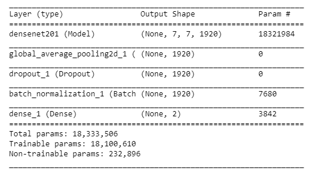
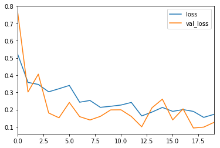
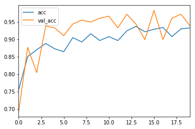
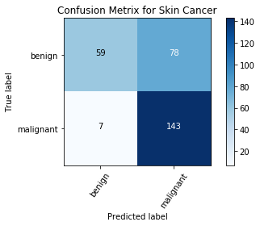
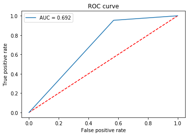
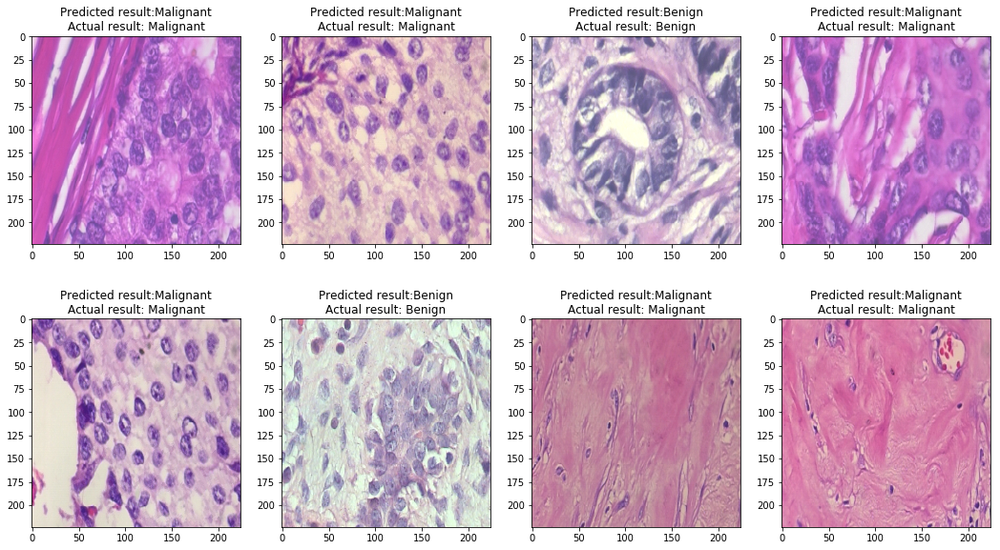
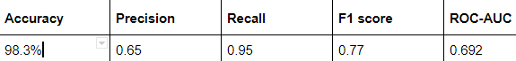

# Breast-Cancer-Classification

Breast Cancer Classification using CNN and transfer learning

## Model

## Results

### Loss/Accuracy vs Epoch

### Confusion Matrix

### ROC-AUC curve

### Correct/Incorrect classification samples

The model is able to reach a validation accuracy of 98.3%, precision 0.65, recall 0.95, f1 score of 0.77 and ROC-AUC as 0.692.
